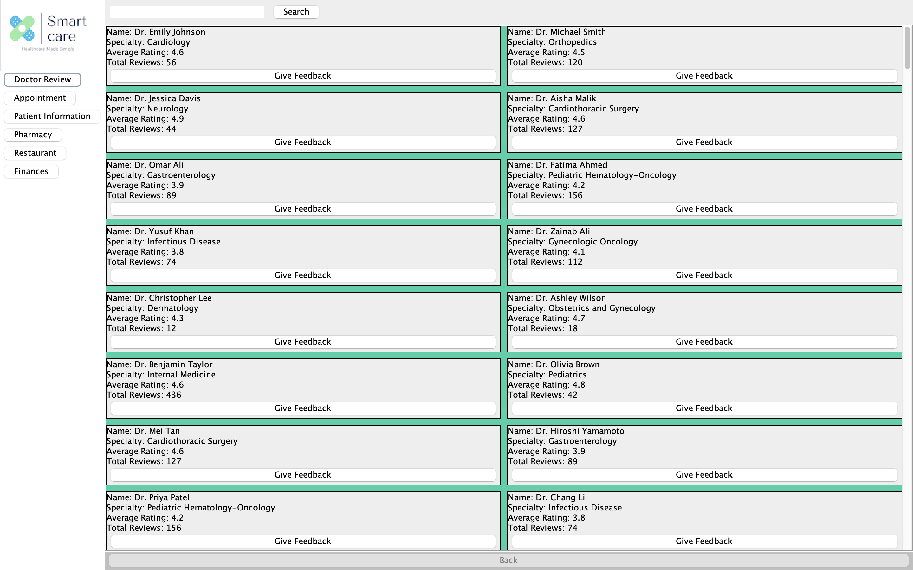

```markdown
# Doctor Review GUI

"Doctor Review" is a Java Swing-based desktop application that allows users to browse, search, and leave feedback for doctors. This project focuses on GUI development and user interaction using Java Swing components, built with Maven and runnable via `.jar` or through an IDE like Eclipse.

## Features

- Displays a list of doctors with:
  - Name
  - Specialty
  - Average Rating
  - Total Reviews
- Search bar for filtering doctors by name or specialty
- Feedback system to submit ratings and comments
- Organized layout using `JPanel`, `JList`, `JTextArea`, and `JTextField`
- Sidebar navigation panel for future expansion (appointments, pharmacy, etc.)

## Tech Stack

- Java (Java SE 17)
- Swing (for GUI)
- Maven (for build management)
- CSV File used as lightweight local data source (`doctors.csv`)

## Run Locally

### Option 1: Using Eclipse
1. Open Eclipse and import the Maven project (`DoctorReviewProject`).
2. Locate `DoctorReviewGUI.java` inside `src/main/java/com/example/demo/`.
3. Right-click on the file and run it as a Java Application.

### Option 2: Run JAR from Terminal
If you've packaged it as a jar (e.g., `doctor-review.jar`):
```bash
java -jar doctor-review.jar
```

> Note: You can press `Tab` to auto-complete the file name after typing `java -jar d...`.

## Preview



## Notes

- The application uses mock data from a CSV file and does not require a database.
- No backend or server-side logic is used; this is a standalone desktop application.
- Designed to demonstrate Java Swing skills and GUI component usage.

```
